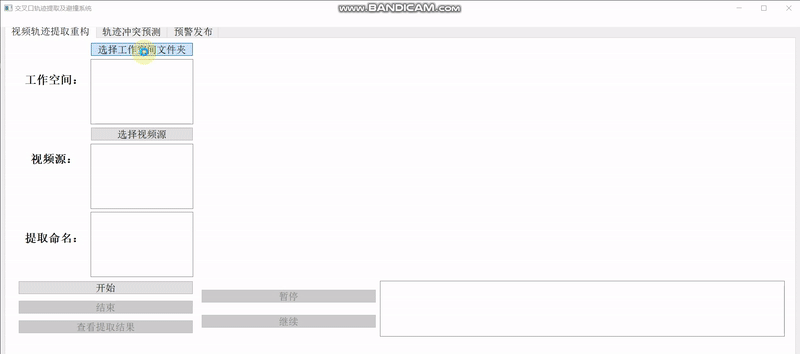
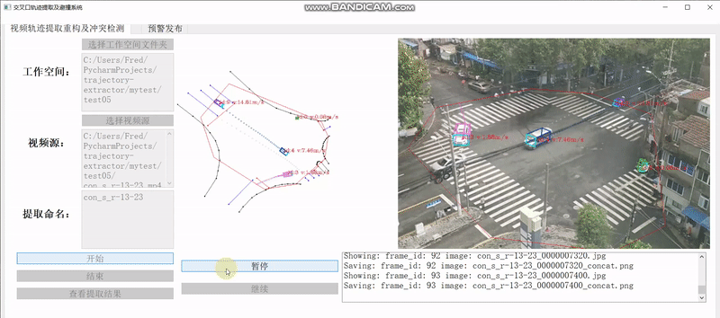

# Intersection trajectory extraction and collision avoidance system
**本项目实现基于视频数据的轨迹提取与重构、轨迹冲突预测、预警发布**

**轨迹提取**



**（侧向）冲突检测**



## Task List

- [x] 轨迹提取与重构
    - [x] 相机标定
    - [x] 轨迹提取、平滑

- [ ] 轨迹冲突检测
    - [x] 侧向与车头碰撞检测(2020.11.24完成)
    - [ ] 车头追尾碰撞检测

- [ ] 预警发布


## Setup
 - python3
 - pyQt5
 - Qt Designer 
    
[使用Pyqt5开发python gui基础教程](https://blog.csdn.net/qq_38412868/article/details/88972863)

[PyCharm如何使用Qt Designer](https://blog.csdn.net/stone0823/article/details/104101130)

## 系统启动

在配置好环境后，运行:

```pyhthon
python controller.py
```


## 使用步骤

- 轨迹提取与重构

    1.选取工作空间
    
    2.选取视频源
    
    3.开始提取
    
    4.查看结果
    
## 更新日志

- 2020.12.05

   基于分离轴定理（[Separating Axis Theorem / Hyperplane separation theorem.](https://en.wikipedia.org/wiki/Hyperplane_separation_theorem)）
   
    解决2020.11.30的三个问题，基于SAT可以一次性实现车头-车身、车头-车尾、车头-车头三种类型碰撞冲突的检测

    发现SAT的过程：

     （1）基于关键词“collision prediction”先找的论文：
     
     *[Atev S, Arumugam H, Masoud O, et al. A vision-based approach to collision prediction at traffic intersections[J]. IEEE Transactions on Intelligent Transportation Systems, 2005, 6(4): 416-423.](https://ieeexplore.ieee.org/document/1549845)*
     
     （2）有了理论找现有的代码实现：
            
     [Separating Axis Theorem / Hyperplane separation theorem](https://github.com/JuantAldea/Separating-Axis-Theorem)
    (python)
    
    [SAT.js](https://github.com/jriecken/sat-js)
    (js)
    
    [collision.py](https://github.com/qwertyquerty/collision)
    (python)
 
 - 待完成：
 
    （1）在完成冲突预测功能后，如何评估冲突预测的准确性？   
    
    
- 2020.11.30 

    添加追尾冲突检测功能，测试出现问题包括：
  
  （1）同一个文件两次检测的侧向冲突竟然不一样
  
  （2）TTC存在负数，不合理
 
  （3）检测到的追尾TTC在0.5附近，画图发现不合理

- 待完成：
  
  （1）画图查看追尾位置是否合理
 
  （2）解决上述3个小问题
    
